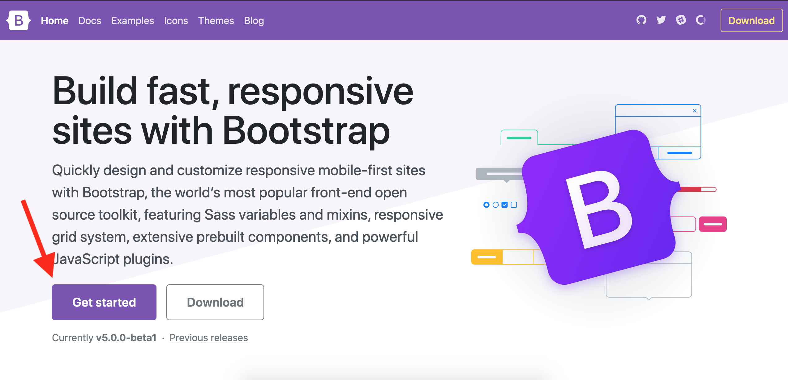
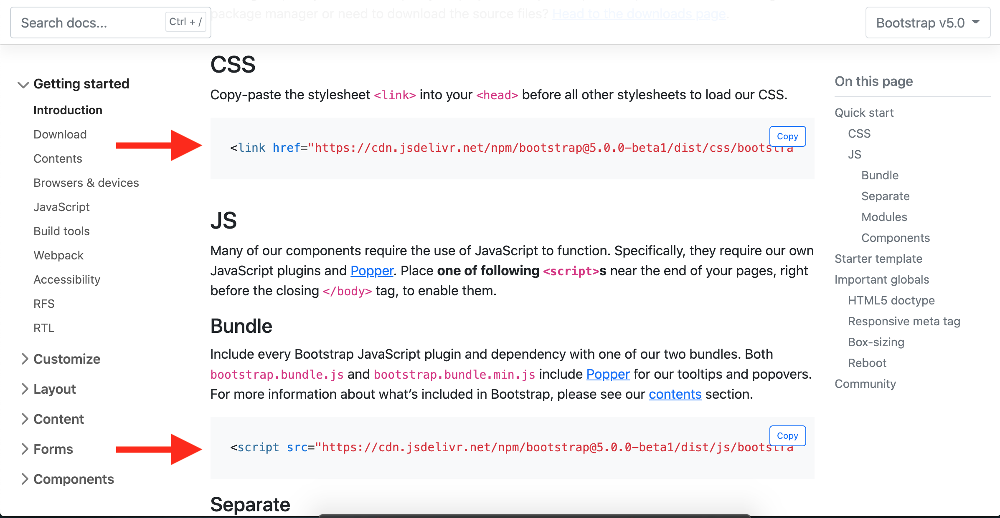

# Bootstrap Basics
You've been hired as a front-end developer by a burgeoning startup called Octopus Industries (pronounced _ock-toepus_ ...they were super adamant about it.) Their website functions well enough but the aesthetic needs major work. The first thing they want is a new, responsive navbar. Next they've asked you to improve their contact form. They've heard that the world's most popular front-end toolkit is called Bootstrap and, therefore, they've requested that you use this "Bootstrap" for their site. 

So what _is_ Bootstrap? From Wikipedia: 
> Bootstrap is a free and open-source CSS framework directed at responsive, mobile-first front-end web development. It contains CSS- and (optionally) JavaScript-based design templates for typography, forms, buttons, navigation, and other interface components.
>
Bootstrap makes it easy to create professional-grade user interfaces with relatively little effort. It's a powerful tool to have in your toolkit (especially if you dislike writing CSS.)

---

## Setup
- Fork and clone this repo to your machine
- `cd` into the directory 
- Use `npm i` to install package dependencies
- Confirm that dependencies were installed successfully by starting the server with `npm start` or `nodemon app.js`

## Getting Set Up

Go to the [Bootrap website](https://getbootstrap.com/) and click on Get Started

---

Copy the CSS `<link>` and paste it into the head of `/views/layout.ejs` **_above_** all other stylesheets. Then copy the JS Bundle `<script>` and paste it at the end of the body of `/views/layout.ejs`

### Wait... What's Going On? 

By adding these tags we are utilizing the Bootstrap CDN. Okay, well, what's that? Here's a definition from cloudflare.com: 

> A content delivery network (CDN) refers to a geographically distributed group of servers which work together to provide fast delivery of Internet content.
>
> A CDN allows for the quick transfer of assets needed for loading Internet content including HTML pages, javascript files, stylesheets, images, and videos.

Behind the scenes there is a fair amount of code that makes Bootstrap work (check out the [Bootstrap Github repo](https://github.com/twbs/bootstrap) if you're interested.) Instead of importing and storing all of this code in our own project directory, we instead utilize Bootstrap's CDN to serve Bootstrap's source code (_note: we are also able to install Bootstrap via an NPM package but for the purposes of this lesson we will be utilizing the CDN via the method described above._)

